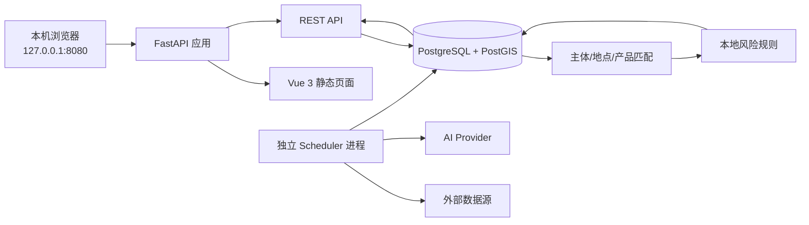

# 供应商风险监控平台 MVP 技术方案

## 1. 文档信息

| 项目 | 内容 |
| --- | --- |
| 文档状态 | MVP 开发基线 |
| 编制日期 | 2026-08-04 |
| 计划开工 | 2026-08-05 |
| MVP 验收 | 2026-08-18 |
| 开发周期 | 10 个工作日 |
| 当前进度 | D9 第二个真实数据源与独立 Scheduler 完成，形成发布候选 |
| 当前部署目标 | 本机 localhost |
| 后续部署方向 | Linux 云服务器 |

本计划以一名全职开发人员、能够获得至少两个可用外部数据源、能够调用至少一个大模型接口为前提。若数据授权、网络访问或供应商清单未按时准备，外部数据接入范围相应缩减，但核心链路仍须使用固定样例完成验收。

## 2. 建设目标

MVP 接收用户准备的重点供应商清单，定时收集外部风险信息，提取风险事件，将事件与供应商主体、生产地点和供应产品进行关联，计算 P1 至 P4 风险等级，并通过 localhost 网页呈现当前风险。

核心链路为：

    外部数据源
      → 风险信号采集与去重
      → AI 结构化提取
      → 风险事件归并
      → 供应商、地点、产品匹配
      → 本地规则评分
      → 风险提醒
      → localhost 网页呈现

## 3. MVP 范围

### 3.1 包含范围

- Excel 导入和维护重点供应商清单。
- 管理供应商法人主体、中英文别名、生产地点和供应产品。
- 接入至少两个真实外部数据源。
- 提供通用手工导入数据源，作为商业数据或临时数据的合规补充。
- 采集任务定时运行，并支持网页手动触发。
- 原始风险信号去重和最小证据留存。
- 通过可替换的大模型适配器完成分类、实体提取、地点提取、翻译和摘要。
- 归并同一风险事件的重复信号。
- 匹配供应商主体、生产地点和供应产品。
- 使用本地规则生成 P1 至 P4 风险等级。
- 展示风险总览、当前风险、风险详情、供应商和数据源运行状态。
- 记录采集、AI 调用、评分和错误日志。

### 3.2 不包含范围

- 库存、订单、在途物流和替代供应商分析。
- 上线前历史风险数据回填。
- 历史趋势、风险预测和供应商风险画像。
- 风险确认、指派、跟进、处置和关闭流程。
- 邮件、短信、企业微信等外部通知。
- 多用户注册、复杂权限和企业单点登录。
- 公网、公司内网服务器或云服务器正式部署。
- 自动停止采购、取消订单或变更供应商。
- 多层级供应商知识图谱。
- 自动化登录、验证码绕过或超出授权范围的数据抓取。

### 3.3 “不做历史数据”的边界

不导入上线前数据，也不建设历史分析功能。但系统必须保留最小运行数据，用于去重、证据追溯和故障定位：

- 原始风险信号和 AI 分析结果默认保留 90 天。
- 风险事件和风险提醒保留至失效后 90 天。
- 采集运行记录默认保留 30 天。
- 应用日志按文件大小和天数轮转。

以上保留期限均通过配置调整。

## 4. 架构原则

1. **本地优先、云端可迁移**：当前绑定 127.0.0.1，未来使用相同容器镜像迁移至 Linux 云服务器。
2. **模块化单体**：一个代码仓库、一个业务后端，按业务模块隔离；MVP 不拆微服务。
3. **Web 与调度分离**：网页服务和定时任务使用同一代码库、不同进程，避免页面重启影响采集。
4. **AI 厂商可替换**：业务层只依赖统一 AIProvider 接口，不直接依赖千问或其他厂商 SDK。
5. **AI 提取、本地决策**：大模型提供结构化事实和建议置信度，本地规则产生最终风险等级。
6. **证据可追溯**：每条提醒都能回到原始来源、证据片段、匹配理由和评分明细。
7. **确定性匹配优先**：企业标识、别名和地理位置优先，AI 模糊匹配只能生成候选。
8. **最小依赖**：MVP 不引入 Kubernetes、Elasticsearch、Kafka、Redis、Celery、图数据库或对象存储。
9. **密钥不落库**：任何 API Key、Token、账号或 Cookie 不进入前端、数据库、日志和 Git。

## 5. 总体架构

### 5.1 本地运行组件

| 组件 | 职责 | MVP 进程形式 |
| --- | --- | --- |
| Web App | API、静态页面、参数校验、查询 | app 容器 |
| Scheduler | 定时采集、AI 解析、事件归并、匹配和评分 | scheduler 容器 |
| PostgreSQL + PostGIS | 业务数据、地理数据、原始 JSON | postgres 容器 |
| Evidence Volume | PDF、HTML 或其他必要原始证据 | Docker 本地卷 |

发布形态使用 Docker Compose。最终用户仅访问 http://127.0.0.1:8080。开发阶段可以使用 Vite 开发服务器，但发布验收必须使用单端口形态。

### 5.2 技术选型

| 层级 | 技术 |
| --- | --- |
| 前端 | Vue 3、TypeScript、Vite、Element Plus、ECharts |
| 后端 | Python 3.12、FastAPI、Pydantic 2 |
| ORM 与迁移 | SQLAlchemy 2、Alembic |
| 数据库 | PostgreSQL 16、PostGIS |
| 定时任务 | APScheduler 独立进程 |
| HTTP 客户端 | HTTPX |
| HTML 解析 | selectolax；必要时使用 BeautifulSoup |
| Excel 导入 | openpyxl |
| AI 接口 | AIProvider 抽象 + OpenAI 兼容协议适配器 |
| 后端测试 | Pytest |
| 前端测试 | Vitest |
| 代码质量 | Ruff、mypy、ESLint、Prettier |
| 本地编排 | Docker Compose |

## 6. 目标项目结构

    SupplierRiskMonitoring/
    ├─ CONTEXT.md
    ├─ 技术方案.md
    ├─ README.md
    ├─ .env.example
    ├─ .gitignore
    ├─ compose.yaml
    ├─ backend/
    │  ├─ pyproject.toml
    │  ├─ alembic.ini
    │  ├─ migrations/
    │  ├─ app/
    │  │  ├─ main.py
    │  │  ├─ core/
    │  │  ├─ suppliers/
    │  │  ├─ sources/
    │  │  ├─ intelligence/
    │  │  ├─ matching/
    │  │  ├─ alerts/
    │  │  ├─ providers/
    │  │  │  ├─ ai/
    │  │  │  └─ sources/
    │  │  └─ scheduler/
    │  └─ tests/
    ├─ frontend/
    │  ├─ package.json
    │  ├─ src/
    │  │  ├─ api/
    │  │  ├─ components/
    │  │  ├─ views/
    │  │  └─ types/
    │  └─ tests/
    └─ data/
       └─ .gitkeep

data 目录只作为本地挂载点，不提交运行数据。

## 7. 业务模块

### 7.1 供应商模块

负责：

- 供应商 Excel 模板下载和导入。
- 使用我司内部供应商编码作为稳定唯一标识。
- 供应商主体、唯一标识、中英文名和别名维护。
- 多生产地点及经纬度维护。
- 多供应产品及关键词维护。
- 数据校验、重复检测和逐行错误报告。
- 启用或暂停监控。

Excel 使用“供应商、生产地点、供应产品”三个工作表。供应商工作表必填：

| 字段 | 说明 |
| --- | --- |
| supplier_code | 我司内部稳定唯一编码 |
| legal_name | 法人主体全称 |
| country_code | 国家或地区代码 |
| registry_no | 统一社会信用代码或境外注册编号，可空 |

生产地点和供应产品工作表均通过 supplier_code 引用供应商。经纬度允许暂时为空，但无法完成精确地理匹配。MVP 不依赖在线地图服务自动解析地址，用户可以在模板中提供经纬度，或在网页中补录。

### 7.2 数据源模块

所有外部来源实现统一 SourceAdapter：

    fetch(cursor) -> RawSourceItem[]
    normalize(item) -> NormalizedSignal
    fingerprint(signal) -> string
    healthcheck() -> SourceHealth

首批数据源选择原则：

- 有明确公开或商业使用授权。
- 来源可靠且能回到原文。
- 更新频率与风险类型匹配。
- 不依赖验证码绕过和自动化登录。
- 能在本机网络环境稳定访问。

MVP 至少实现：

1. 一个自然灾害或天气类真实来源。
2. 一个企业公告、监管、政策或制裁类真实来源。
3. 一个标准 Excel/JSON 手工导入来源。

手工来源的 D3 实现固定使用系统内置 `manual-json` 数据源。上传文件为 UTF-8
JSON，包含版本号和信号数组；每条信号包含标题、正文，可选外部编号、原文链接和
带时区的发布时间。文件先完整校验，再写入原始信号；同一来源下使用规范化内容的
SHA-256 指纹去重。无效文件不写入信号，但保留失败的采集运行记录。

天眼查付费会员是否包含开放 API、批量导出或自动化使用权，必须以合同和天眼查书面授权为准。未取得接口授权时，仅实现合同允许的人工导出文件导入，不保存会员账号密码和 Cookie。

### 7.3 AI 情报解析模块

业务层定义统一接口：

    analyze_signal(input: SignalAnalysisInput) -> SignalAnalysisResult

SignalAnalysisResult 至少包含：

- 事件类型。
- 建议严重性。
- 涉及组织及其别名。
- 涉及国家、行政区和具体地点。
- 受影响活动：生产、物流、贸易、经营、司法或合规。
- 涉及产品或行业。
- 事件开始时间和预计结束时间。
- 中文摘要。
- 关键证据句。
- 模型置信度。

#### AI 厂商切换

运行配置包括：

| 配置项 | 说明 |
| --- | --- |
| AI_PROVIDER | 适配器名称 |
| AI_BASE_URL | 模型接口地址 |
| AI_MODEL | 模型名称 |
| AI_API_KEY | API 密钥 |
| AI_TIMEOUT_SECONDS | 超时时间 |
| AI_MAX_RETRIES | 最大重试次数 |

首版优先实现 OpenAICompatibleProvider。支持兼容 OpenAI Chat Completions 或 Responses 风格协议的厂商时，只需更换配置；不兼容的厂商新增独立适配器，不修改情报、匹配和风险模块。

同时实现 FakeAIProvider，供测试和无外网演示使用。业务测试不得调用真实模型接口。

D4 的首版实现使用 OpenAI Chat Completions 兼容协议和 JSON Object 输出约束；
业务层只依赖 AIProvider。每次分析保存厂商、模型、提示词版本、耗时、结构化结果
或脱敏后的失败原因。默认启用 FakeAIProvider，只有本地环境变量完整配置后才调用
真实厂商接口。

#### AI 安全和稳定性

- 只向外部模型发送必要的公开风险文本，不发送完整供应商清单。
- 外部网页文本一律视为不可信输入，防范提示注入。
- 使用固定系统提示词和结构化输出约束。
- 使用 Pydantic 验证返回值，拒绝缺失必要字段的结果。
- 记录厂商、模型名、提示词版本、耗时和结果状态，但不记录密钥。
- 超时或失败时重试；最终失败的信号保持待解析状态，不生成无依据提醒。

### 7.4 事件归并模块

风险信号不直接等于风险事件。归并依据包括：

- 相同来源的外部唯一编号。
- 规范化标题和正文指纹。
- 主体、地点、事件类型和时间窗口相近。
- 同一官方公告被多个渠道转载。

一个风险事件可以关联多个风险信号。MVP 先使用确定性规则归并，AI 只辅助生成候选，不实现向量数据库。

### 7.5 供应商匹配模块

匹配顺序：

1. 注册编号或统一社会信用代码精确匹配。
2. 法人全称、英文名、曾用名和别名标准化匹配。
3. 事件地点与生产地点的 PostGIS 空间范围匹配。
4. 事件产品、行业与供应产品关键词匹配。
5. AI 模糊匹配只作为低置信候选，不能独立触发 P1。

D6 已实现前四类确定性匹配：注册编号、法人全称和供应商别名使用标准化精确
匹配；事件同时提供明确经纬度和影响半径时，使用 WGS84 geography 与
`ST_DWithin` 匹配生产地点；缺少坐标时，只使用地区、城市或地点名称匹配，
单独同国家不生成关联；产品只匹配 AI 明确提取的受影响产品与人工维护的产品
名称、关键词。地点或产品单独命中的弱关联最高为 P2。

匹配结果必须记录：

- 匹配类型。
- 匹配对象。
- 匹配分数。
- 人类可读的匹配理由。
- 使用的证据。

### 7.6 风险评分模块

D5 先使用固定版本 `risk-score-v0` 打通纵向链路：事件严重程度、精确关联、
来源可信度和是否提供发布时间参与评分；D6 在产品确定性命中时增加产品相关性
分值，并对纯地点或产品弱关联设置 P2 上限。D7 再完成可配置评分、强制规则、
提醒失效和完整去重策略。

初始评分满分 100：

| 维度 | 分值 | 说明 |
| --- | ---: | --- |
| 事件严重程度 | 0～35 | 根据事件类型和客观事实映射 |
| 关联强度 | 0～30 | 企业、地点或产品匹配强度 |
| 来源可信度 | 0～20 | 官方、授权商业源、一般公开源 |
| 时效性 | 0～10 | 发布时间和事件有效期 |
| 产品相关性 | 0～5 | 是否直接涉及供应产品 |

初始分级：

| 等级 | 分数 | 含义 |
| --- | --- | --- |
| P1 | 85～100 | 已确认或高度确定的重大直接风险 |
| P2 | 65～84 | 很可能产生直接影响 |
| P3 | 40～64 | 存在明确相关性，需要关注 |
| P4 | 0～39 | 弱信号或观察信息 |

支持强制规则，例如供应商主体直接命中生效中的制裁名单时，可以直接生成 P1。每次评分保存规则版本和各维度得分，后续调整规则不得改变已经产生提醒的原始解释。

### 7.7 风险提醒模块

风险提醒包含：

- 风险等级和总分。
- 供应商主体、生产地点和供应产品。
- 事件类型、摘要和有效期。
- 触发规则和评分明细。
- 匹配理由和证据片段。
- 原始来源链接。
- 发布时间和采集时间。
- AI 厂商、模型和置信度。
- 当前或已失效状态。

MVP 不提供确认、分派、备注、跟进、关闭和处置动作。

## 8. 数据模型

### 8.1 核心表

| 表 | 作用 | 关键字段 |
| --- | --- | --- |
| suppliers | 供应商主体 | legal_name、country_code、registry_no、enabled |
| supplier_aliases | 名称别名 | supplier_id、alias、language |
| supplier_sites | 生产地点 | supplier_id、address、country、region、city、geom |
| supplier_products | 供应产品 | supplier_id、name、keywords |
| data_sources | 数据源 | name、type、credibility、schedule、enabled |
| collection_runs | 采集运行记录 | source_id、started_at、finished_at、status、counts、error |
| raw_signals | 风险信号 | source_id、external_id、title、content、url、published_at、fingerprint |
| ai_analysis_records | AI 解析记录 | signal_id、provider、model、prompt_version、result、status |
| risk_events | 风险事件 | type、severity、summary、start_at、end_at、confidence |
| risk_event_signals | 事件与信号关系 | event_id、signal_id |
| event_entities | 事件涉及主体 | event_id、name、registry_no |
| event_locations | 事件地点 | event_id、name、geom、radius_km |
| supplier_event_matches | 风险关联 | supplier_id、site_id、event_id、match_type、score、reasons |
| risk_alerts | 风险提醒 | match_id、level、score、score_detail、status、expires_at |

### 8.2 约束

- suppliers 的 country_code 与 registry_no 组合唯一。
- raw_signals 的 source_id 与 fingerprint 组合唯一。
- 同一供应商和风险事件只能存在一个当前风险提醒。
- 地理字段统一使用 WGS84。
- 所有时间在数据库中使用 UTC，页面按本地时区显示。
- JSON 字段必须通过后端模型校验后写入。

## 9. API 设计

所有接口统一使用 /api/v1 前缀。

### 9.1 供应商

| 方法 | 路径 | 用途 |
| --- | --- | --- |
| GET | /suppliers | 查询供应商 |
| GET | /suppliers/{id} | 查询详情 |
| POST | /suppliers/import | 导入 Excel |
| GET | /suppliers/import-template | 下载模板 |
| POST | /suppliers | 新增供应商 |
| PUT | /suppliers/{id} | 修改供应商 |
| PATCH | /suppliers/{id}/enabled | 启停监控 |

### 9.2 风险

| 方法 | 路径 | 用途 |
| --- | --- | --- |
| GET | /dashboard/summary | 风险总览 |
| POST | /signals/{id}/process | AI 解析、事件归并、基础匹配、评分和提醒 |
| GET | /risk-alerts | 查询当前或已失效提醒 |
| GET | /risk-alerts/{id} | 风险详情 |
| GET | /events/{id} | 事件及全部证据 |

### 9.3 数据源与任务

| 方法 | 路径 | 用途 |
| --- | --- | --- |
| GET | /sources | 数据源和健康状态 |
| GET | /collection-runs | 采集运行记录 |
| POST | /sources/{id}/run | 手动执行一次采集 |
| POST | /signals/import | 手工导入信号文件 |
| GET | /system/health | 应用和数据库健康检查 |

MVP 在 localhost 运行且默认单用户，不实现登录。所有服务只绑定 127.0.0.1；在增加认证和 HTTPS 前，禁止改为 0.0.0.0 或部署公网。

## 10. 页面设计

### 10.1 风险总览

- P1 至 P4 当前数量。
- 今日新增风险。
- 风险类型和地区分布。
- 最近风险列表。
- 各数据源最后成功时间。
- 采集或 AI 服务异常提示。

### 10.2 当前风险

- 按等级、供应商、国家地区、风险类型、供应产品和来源筛选。
- 默认只显示当前有效提醒。
- 支持查看已失效提醒，但不提供历史统计。

### 10.3 风险详情

- 风险摘要、等级、分数和评分明细。
- 命中的供应商、地点和产品。
- 匹配理由和证据片段。
- 原始来源链接。
- AI 信息和置信度。
- 事件有效时间。

### 10.4 供应商

- 列表、搜索、详情和启停。
- Excel 模板下载与导入。
- 导入结果和逐行错误报告。

### 10.5 数据源

- 数据源列表和启停状态。
- 最近执行时间、结果和错误。
- 手动执行采集。

## 11. 配置与密钥

.env.example 只包含变量名和非敏感示例值。实际 .env 必须被 .gitignore 排除。

配置分类：

- 应用端口和日志级别。
- 数据库连接。
- 数据保留期限。
- 调度周期。
- AI 厂商、地址、模型、超时和重试次数。
- 各数据源非敏感参数。

API Key 只通过环境变量注入。日志输出前必须对 Authorization、Cookie、Token、API Key 和数据库密码字段脱敏。

## 12. 本地部署与云迁移

### 12.1 MVP 本地部署

- Docker Compose 启动 app、scheduler 和 postgres。
- Web 服务绑定 127.0.0.1:8080。
- PostgreSQL 不向局域网暴露端口。
- 数据库和证据文件使用 Docker 本地卷。
- 本机必须能够通过受控网络访问选定数据源和 AI 接口。
- 电脑关机、休眠或 Docker 停止期间不进行监控。

### 12.2 后续云服务器迁移

复用现有代码和容器，新增：

- Linux 云服务器和域名。
- Nginx 或等效反向代理。
- HTTPS。
- 用户认证、角色权限和密码策略。
- 防火墙、安全组和接口限流。
- 自动备份、恢复演练和监控告警。
- 密钥管理服务。
- 数据合规和第三方数据授权复核。

初期云部署仍使用 Docker Compose，不使用 Kubernetes。数据量和并发证明确有需要后，再评估 Redis、Celery、对象存储和托管数据库。

## 13. 测试策略

### 13.1 单元测试

- 供应商 Excel 校验和重复检测。
- 风险信号指纹和去重。
- AI 返回结构校验。
- 企业名称和别名标准化。
- 地理范围匹配。
- 产品关键词匹配。
- 风险分数和强制规则。
- 提醒失效判断。

### 13.2 集成测试

- 数据源适配器到 raw_signals。
- FakeAIProvider 到风险事件。
- 风险事件到供应商关联。
- 关联到风险提醒。
- 数据库迁移从空库完整执行。
- API 查询与筛选。

### 13.3 端到端验收场景

1. 导入包含多个生产地点和产品的供应商，页面展示正确。
2. 严重天气事件覆盖某生产地点，生成高等级提醒并展示地理匹配理由。
3. 企业公告直接提及供应商法人主体，按名称或注册编号生成关联。
4. 只提及供应商所在国家、无直接地点和主体证据的弱信号不能生成 P1。
5. 相同公告被两个来源转载，只形成一个风险事件和一条当前提醒。
6. AI 接口超时后自动重试；最终失败时不生成无依据提醒。
7. 非法或缺列 Excel 返回逐行错误，不破坏已有供应商数据。
8. 所有风险详情能够打开原始来源并查看评分明细。

## 14. MVP 验收标准

### 14.1 功能

- 能通过一条命令启动完整系统。
- http://127.0.0.1:8080 可正常访问。
- 能导入不少于 100 家供应商的标准 Excel。
- 至少两个真实数据源完成端到端采集。
- 手工导入来源可正常使用。
- 至少一个真实 AI 模型厂商接入成功。
- 切换模型不需要修改风险和匹配业务代码。
- 能完成信号、事件、关联、评分、提醒全链路。
- P1 至 P4 可筛选，详情证据完整。
- 电脑重启并重新启动容器后数据仍存在。

### 14.2 质量

- 核心单元测试和集成测试全部通过。
- 评分规则、匹配规则和 AI 结构校验具有自动测试。
- 重复信号不会重复生成当前提醒。
- API Key 和 Token 不出现在 Git、页面和日志中。
- 数据库迁移可以在空数据库一次完成。
- 关键错误在页面或日志中有明确原因。

### 14.3 范围

- 不出现库存、替代来源和处置工作流的半成品功能。
- 不以普通启动成功替代端到端风险场景验收。
- 不在未增加认证和 HTTPS 前开放公网或局域网访问。

## 15. 两周开发计划

计划起点为 2026-08-05。如实际开工日期变化，保持 D1 至 D10 顺序和验收门槛，整体平移。

### 第一周：打通可运行的纵向链路

| 工作日 | 日期 | 主要任务 | 当日交付与验收 |
| --- | --- | --- | --- |
| D1 | 08-05 | 初始化仓库；建立前后端、Compose、PostgreSQL/PostGIS、迁移、测试和质量工具；确定首批数据源可用性 | 一条命令启动；健康检查通过；空库迁移通过；不含真实密钥 |
| D2 | 08-06 | 实现供应商、别名、生产地点、产品模型；Excel 模板、导入和校验接口 | 能导入样例供应商；重复和错误行有明确报告；相关测试通过 |
| D3 | 08-07 | 实现 SourceAdapter、数据源、采集运行记录、原始信号、指纹去重；完成手工导入适配器 | 同一文件重复导入不产生重复信号；失败可追踪 |
| D4 | 08-10 | 实现 AIProvider、OpenAICompatibleProvider、FakeAIProvider、结构化 Schema、超时重试和脱敏日志 | Fake 和一个真实模型均能返回合法结构；业务测试不访问真实 API |
| D5 | 08-11 | 实现风险事件、信号归并、基础风险评分和最小查询页面 | 完成“样例信号→AI→风险事件→提醒→网页”纵向链路；第一周评审 |

第一周里程碑：即使真实数据源临时不可用，也必须使用固定样例和 FakeAIProvider 演示完整链路，不能让外部依赖阻塞核心开发。

### 第二周：完成真实匹配、界面和验收

| 工作日 | 日期 | 主要任务 | 当日交付与验收 |
| --- | --- | --- | --- |
| D6 | 08-12 | 实现主体别名匹配、PostGIS 地理匹配、产品关键词匹配和匹配解释 | 三类匹配均有自动测试；弱关联不能触发 P1 |
| D7 | 08-13 | 完成可配置评分、P1 至 P4、强制规则、提醒去重和自动失效 | 评分明细可解释；重复事件只有一条当前提醒 |
| D8 | 08-14 | 完成风险总览、当前风险、详情、供应商和数据源页面 | 主要页面在 127.0.0.1:8080 单端口可用；功能冻结 |
| D9 | 08-17 | 接入第二个真实数据源；实现独立 Scheduler、手动触发、重试、保留清理；完成安全和异常检查 | 两个真实来源可采集；密钥检查通过；形成发布候选版本 |

D9 已完成：接入中央气象台天气预警（`nmc-weather`，拉取式 SourceAdapter）；独立
Scheduler 容器（APScheduler，采集/AI 解析/归并/评分/失效/清理）；`POST /sources/{id}/run`
手动触发；保留清理（信号与 AI 分析 90 天、事件与提醒失效后 90 天、采集运行 30 天，可配置）；
安全审计（`.env.example` 真实密钥清除、全库扫描无残留、错误消息不携带密钥）。
| D10 | 08-18 | 执行全部自动测试和八个端到端场景；修复阻断问题；完善 README、启动、备份和演示说明 | 所有 MVP 验收标准有证据；完成演示和验收记录 |

第二周里程碑：

- D8 功能冻结，之后只修复阻断问题。
- D9 形成 Release Candidate。
- D10 完成 MVP 验收，不把未完成项包装成已交付功能。

## 16. 开发完成定义

一个功能只有同时满足以下条件才算完成：

- 代码、数据库迁移和必要文档齐全。
- 正常路径和主要错误路径均有测试。
- 页面或 API 可以实际操作。
- 不打印或提交密钥。
- 错误信息能定位问题。
- Docker Compose 发布形态验证通过。
- 未引入超出 MVP 范围的隐性依赖。

## 17. 主要风险与应对

| 风险 | 影响 | 应对 |
| --- | --- | --- |
| 天眼查会员不含 API 权限 | 无法自动采集商业数据 | D1 核验合同；先实现合规文件导入 |
| 真实数据源不稳定或受限 | 延误端到端联调 | SourceAdapter 隔离；固定样例保证核心链路 |
| 不同模型结构化能力不同 | 解析失败或字段漂移 | Provider 抽象、Schema 校验、重试和 Fake Provider |
| 生产地点缺少经纬度 | 地理匹配精度不足 | Excel 增加可选经纬度；页面标记待补数据 |
| 同名企业误匹配 | 高风险误报 | 注册编号优先；别名匹配保存理由；模糊匹配降级 |
| 新闻重复转载 | 提醒泛滥 | 指纹去重加事件归并 |
| 本机休眠或停机 | 监控中断 | 页面明确最后采集时间；MVP 接受，云部署后解决 |
| 两周范围膨胀 | 无法形成完整链路 | 严格执行范围和 D8 功能冻结 |

## 18. 开工前准备清单

开发者在 D1 前确认：

- 一份脱敏后的供应商清单样例，建议 10 至 20 家。
- 每家供应商至少包含法人主体、国家或地区、生产地点和供应产品。
- 能提供时增加统一社会信用代码、境外注册编号、英文名和经纬度。
- 一个可用于开发测试的 AI API，明确接口协议、模型名、额度和限流。
- 天眼查合同中 API、导出和自动化使用权限的书面范围。
- 两类优先风险数据源及其访问条件。
- 本机 Docker、Git、Python 和 Node.js 的现状；先检测，未经授权不安装或升级。
- 5 至 8 条用于验收的模拟风险事件。

## 19. 暂缓决策

以下内容不阻塞 MVP，留到本地验证后决定：

- 最终云厂商和服务器规格。
- 正式域名和公网访问策略。
- 用户体系、角色和单点登录。
- 邮件或企业微信通知。
- Redis、Celery 和对象存储。
- 在线地图和地理编码服务。
- 历史分析、库存影响和风险处置流程。

## 20. 开发启动顺序

正式开发从 D1 基础设施开始，并设置三个不可跳过的验收门：

1. **基础门**：空库迁移、健康检查和测试框架通过后，才能开发业务功能。
2. **纵向链路门**：D5 完成“信号到网页提醒”的全链路后，才能扩展真实数据源和页面。
3. **发布门**：D10 必须使用全新数据库和不含密钥的配置完成一次干净启动及端到端验收。
