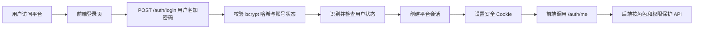

# 登录认证与角色权限生产上线规划

## 文档状态

- 状态：实施中
- 开发状态：Phase 1、Phase 2、Phase 3 已通过门禁；Phase 4 生产发布加固包已通过预发布门禁，尚未部署正式环境
- 启动记录：2026-08-10 已收到产品负责人启动通知
- 身份认证方案变更（2026-08-10）：放弃企业 OIDC / IdP 集成，改为平台本地账号 + 密码（bcrypt）+ 服务端会话方案。详见 §2.1。
- 适用范围：供应商风险监控平台生产级多用户访问
- 当前假设：单一企业组织内部使用，所有已授权用户共享同一业务数据集；本阶段不建设多租户隔离

## 1. 目标与非目标

### 1.1 目标

1. 使用平台本地账号体系完成登录、退出和账号生命周期管理（用户名 + 密码，bcrypt 哈希）；本阶段不接入企业 IdP / OIDC，不涉及 MFA。
2. 服务端可信识别用户身份，彻底移除浏览器自报 `X-User-Role` 的授权方式。
3. 用四个固定角色覆盖当前业务需求：只读用户、风险分析员、风险运营管理员、平台管理员。
4. 对所有业务读写接口实施默认拒绝、按权限授权和敏感操作审计。
5. 支持会话过期、主动退出、用户停用、角色变更后的即时会话撤销。
6. 确保风险助手会话按用户隔离，避免通过会话 ID 越权读取其他用户对话。

### 1.2 非目标

- 本阶段自建平台本地密码认证（用户名 + 密码，bcrypt 哈希），但**不**建设短信验证码、邮件 / 密码找回、MFA / 二次验证，也**不**引入企业 IdP / OIDC。
- 本阶段不建设动态角色编辑器或可视化权限策略引擎。
- 本阶段不建设多租户数据隔离；若未来服务多个独立组织，需另立多租户设计和迁移计划。
- 本阶段不把平台管理员拆成多个运维子角色。

## 2. 核心架构决策

### 2.1 身份认证

采用平台自建的本地账号体系，**不接入企业 OIDC / IdP**：

- 用户在 `users` 表以 `username` 唯一识别，密码使用 bcrypt 哈希存储；浏览器与前端不触碰明文密码或任何凭据。
- 登录通过 `POST /auth/login` 提交用户名与密码（全程 HTTPS），后端校验 bcrypt 哈希；不使用 Authorization Code、PKCE、state/nonce 等 OIDC 机制，也不依赖任何外部身份提供商。
- 首个 `platform_admin` 由启动环境变量 `BOOTSTRAP_ADMIN_USERNAME` / `BOOTSTRAP_ADMIN_PASSWORD` 在库内尚无用户时一次性创建；创建后应从配置移除，避免弱口令长期留存。
- 本阶段不建设密码找回、邮件 / 短信验证码和 MFA；用户密码由平台管理员初始化或用户自助修改。

登录成功后由后端创建不透明会话，仍使用 §2.2 的会话 Cookie 策略，浏览器同样不持有 Token。

### 2.2 会话

登录成功后由后端创建不透明会话，使用 `HttpOnly`、`Secure`、`SameSite=Lax` Cookie 保存会话标识。

建议默认策略：

- 空闲超时：30 分钟。
- 绝对超时：8 小时。
- 本阶段不强制 MFA；未来若接入企业 IdP 可再补充二次验证要求。
- 用户停用、角色变更、管理员主动撤销时立即废止现有会话。
- 登录请求强制校验 `Origin`；登录后的写请求同时校验 `Origin` 和由会话令牌派生的双提交 CSRF Token。

### 2.3 授权

服务端每个请求都根据当前会话加载用户和角色，不信任浏览器提交的角色、用户 ID 或权限列表。

第一版每个用户只有一个角色，数据库保存 `role` 字段；权限集合固定在代码中，不引入角色继承表和动态权限配置。角色变更必须写入安全审计，并撤销用户现有会话。

## 3. 领域模型

### 用户

用户是由平台管理员创建的本地账号，以唯一 `username` 识别。邮箱和显示名称仅作为展示属性，不能作为稳定主键。

### 角色

角色是平台权限集合，不等同于企业岗位名称。一个用户在本阶段只拥有一个角色。

### 权限

权限是服务端允许执行的业务动作，例如查看风险、维护供应商、发布规则、管理用户。

### 会话

会话是用户完成登录后在平台内的访问状态，必须可过期、可撤销并可追溯到用户。

### 安全审计事件

安全审计事件记录登录、退出、认证失败、越权、角色变更、用户停用和会话撤销等行为；记录必须脱敏且不可由普通业务接口修改或删除。

### Agent 会话

Agent 会话是风险助手或数据源接入助手的对话容器，必须关联所属用户和助手类型。用户只能读取、继续或关闭自己的 Agent 会话。

## 4. 四角色权限设计

| 角色 | 代码 | 定位 |
|---|---|---|
| 只读用户 | `viewer` | 查看平台业务数据，不产生业务写入 |
| 风险分析员 | `risk_analyst` | 进行风险分析、查询和报告导出 |
| 风险运营管理员 | `risk_admin` | 维护供应商、数据源、规则和风险处理流程 |
| 平台管理员 | `platform_admin` | 管理用户、角色、会话和平台全部功能 |

权限集合按以下层级累加，但实际实现为四套固定权限集合：

```text
platform_admin
  └─ risk_admin
       └─ risk_analyst
            └─ viewer
```

| 功能 | viewer | risk_analyst | risk_admin | platform_admin |
|---|:---:|:---:|:---:|:---:|
| 查看风险总览、提醒、事件 | ✓ | ✓ | ✓ | ✓ |
| 查看供应商和生产地点 | ✓ | ✓ | ✓ | ✓ |
| 查看数据源运行状态 | ✓ | ✓ | ✓ | ✓ |
| 查看规则摘要和版本 | ✓ | ✓ | ✓ | ✓ |
| 使用风险查询助手 |  | ✓ | ✓ | ✓ |
| 授权的外部企业核查 |  | ✓ | ✓ | ✓ |
| 导出风险报告 |  | ✓ | ✓ | ✓ |
| 新增、修改、导入、停用供应商 |  |  | ✓ | ✓ |
| 导入风险信号、执行分析和风险处理 |  |  | ✓ | ✓ |
| 新增、修改、发布、启停数据源 |  |  | ✓ | ✓ |
| 手动触发数据源采集 |  |  | ✓ | ✓ |
| 使用数据源接入 Agent |  |  | ✓ | ✓ |
| 测试、启停和发布规则 |  |  | ✓ | ✓ |
| 查看业务操作审计 |  |  | ✓ | ✓ |
| 用户启停和角色分配 |  |  |  | ✓ |
| 撤销用户会话 |  |  |  | ✓ |
| 查看登录和安全审计 |  |  |  | ✓ |
| 修改认证和平台安全配置 |  |  |  | ✓ |

取消独立的审计员角色，但保留审计能力：风险运营管理员查看业务操作审计，平台管理员查看完整安全审计。

## 5. 登录流程



详细要求：

1. `POST /auth/login` 校验用户名与 bcrypt 密码哈希，并对账号 `status` 做检查；连续失败应限流，且不向客户端区分"用户不存在"与"密码错误"。
2. 登录成功后创建服务端不透明会话，会话标识哈希写入 `auth_sessions`，并设置 `HttpOnly`、`Secure`、`SameSite=Lax` Cookie。
3. 以 `username` 查找用户，不使用邮箱作为身份主键；用户由平台管理员创建并分配角色，不接受自助注册。
4. 新创建用户默认 `active`（由管理员显式分配角色）；不得自动获得管理员权限，首位管理员仅由启动引导变量创建。
5. 登录成功后创建会话并记录安全审计事件。
6. 前端通过 `/auth/me` 获取真实用户、角色和权限，不能自行切换角色；移除前端"管理员/只读模式"切换按钮。
7. 任何业务接口均通过服务端依赖检查登录状态和具体权限，不再信任 `X-User-Role` / `X-User-Id` 请求头。

## 6. 建议数据模型

新增或调整以下数据：

### `users`

- `id`
- `username`：登录名，唯一
- `password_hash`：bcrypt 哈希，永不明文存储或返回
- `email`：可选，仅展示
- `display_name`：展示名
- `role`：`viewer`、`risk_analyst`、`risk_admin`、`platform_admin`
- `status`：`pending`、`active`、`disabled`
- `password_changed_at`
- `last_login_at`
- `created_at`、`updated_at`

对 `username` 建唯一约束。邮箱允许变化，不作为身份主键。

### `auth_sessions`

- 随机会话标识的哈希值
- `user_id`
- 创建时间、最近活动时间、过期时间
- 撤销时间和撤销原因
- 脱敏后的 IP、User-Agent 或请求追踪信息

### `security_audit_events`

- 操作者用户 ID或系统主体
- 动作、资源类型、资源 ID
- 成功/失败结果
- 请求 ID、来源 IP、时间
- 脱敏后的变更摘要

禁止写入 Cookie、Token、OIDC 完整声明、API Key 和明文凭据。

### `agent_sessions`

增加 `owner_user_id`，并在查询、继续对话和删除时强制按当前用户过滤。现有历史会话在认证迁移时应全部过期，或明确归属后再开放访问。

## 7. 现有接口整改范围

以下当前写接口必须纳入统一授权：

- 供应商新增、修改、导入、启停。
- 风险信号导入。
- AI 分析和风险处理。
- 手动使风险提醒失效。
- 数据源新增、修改、发布、删除、启停、运行。
- 数据源接入 Agent。
- 规则测试、启停和配置更新。

所有业务读取接口也必须要求登录。仅保留以下公开路径：

- 前端静态资源。
- 登录和退出入口。
- 最小化存活探针。

生产环境应关闭或限制 API 文档和 OpenAPI 文件。

数据源接口需要拆分：普通用户只看运行状态，`risk_admin` 才能读取完整适配器配置和管理操作。

## 8. 分阶段实施计划

### 阶段 0：方案确认

- 确认不使用企业 OIDC / IdP，采用平台本地账号 + 密码（bcrypt）+ 服务端会话方案。
- 确认单组织范围；若需要多租户，停止本方案并另立设计。
- 确认首位 `platform_admin` 的启动引导方式（环境变量 `BOOTSTRAP_ADMIN_USERNAME` / `BOOTSTRAP_ADMIN_PASSWORD`），并约定创建后移除配置。
- 固化四角色权限矩阵和接口清单。

### 阶段 1：后端认证基础

- 增加用户、会话和安全审计迁移。
- 实现登录、当前用户、退出和会话撤销接口。
- 实现 `current_user`、`require_permission` 等服务端授权依赖。
- 移除对 `X-User-Role` 和 `X-User-Id` 的信任。
- 给 Agent 会话补充用户所有权。

### 阶段 2：全接口授权

- 为每条业务路由声明权限。
- 补齐供应商、信号、AI、风险提醒等现有缺口。
- 拆分数据源摘要和管理员详情响应。
- 为用户启停、角色变更、规则发布、数据源发布等敏感动作写审计。

### 阶段 3：前端登录改造

- 删除“切换管理员模式/只读模式”按钮。
- 增加登录页、当前用户信息和退出入口。
- 根据 `/auth/me` 返回的权限显示菜单和操作按钮。
- 统一处理 `401`、`403`、会话过期和 CSRF 失败。

### 阶段 4：部署加固

- 由反向代理暴露 HTTPS，FastAPI 仅在内部网络监听。
- 配置 TLS、HSTS、CSP、安全响应头和请求限制。
- 会话密钥进入生产密钥管理服务；生产模式缺少独立强密钥、Secure Cookie 或来源白名单时拒绝启动。
- 建立数据库备份、会话清理和安全审计保留策略。

### 阶段 5：预发布和灰度上线

- 在预发布环境使用与生产一致的 HTTPS、Cookie 和来源白名单配置。
- 预建平台管理员和四类测试账号。
- 完成权限矩阵、越权、会话撤销和审计验收。
- 灰度开放内部用户，确认稳定后再开放正式访问入口。

## 9. 测试与上线门禁

必须通过以下检查：

- 伪造 `X-User-Role: admin` 无法获得管理员权限。
- 未登录访问业务 API 返回 `401`。
- 已登录越权访问返回 `403`。
- 角色变更、用户停用和主动退出能立即撤销会话。
- 用户无法读取其他用户的 Agent 会话。
- 错误密码不泄露账号是否存在（统一错误文案）；弱口令在创建或修改时被拒绝。
- Cookie、Token、密钥不会写入日志或前端持久化存储。
- 所有敏感写操作均有脱敏审计记录。
- 同一用户多标签页和多设备会话行为符合预期。
- HTTPS、反向代理、备份恢复和认证故障回滚演练通过。

## 10. 预计开发涉及的文件范围

收到启动通知后，预计按最小范围修改：

- 新增 `backend/app/auth` 认证、会话、权限和审计模块（本地账号 + 密码 + 服务端会话，不含 OIDC / IdP 客户端依赖）。
- 新增一条 Alembic 迁移，创建用户/会话/安全审计表并补充 Agent 会话归属。
- 修改现有各业务 Router，统一接入登录和权限依赖。
- 修改 `frontend/src/api.ts`、`App.tsx` 和登录相关组件，移除前端角色切换。
- 更新 `compose.yaml`、生产部署说明和认证配置示例。
- 新增认证、授权、越权、会话和 Agent 会话隔离测试。

当前已收到启动通知；按阶段门禁实施，Phase 1 验收通过后再进入 Phase 2。

## 11. Phase 1 修复记录（2026-08-10）

本轮先修复 WorkBuddy 初版自检发现的运行与安全阻断项，再进入 Phase 2：

- 修正认证端点的 JSON 请求体解析，补齐退出路由和静态资源挂载所需导入。
- 生产环境通过 `APP_ENV=production` 启用会话密钥、Secure Cookie 和来源白名单启动门禁。
- 登录请求强制校验 `Origin`；认证后的写请求增加双提交 CSRF Token。
- 首位管理员密码复用统一弱口令校验，启动引导失败不得静默忽略。
- 验收要求：`0020` 迁移、认证专项测试、Ruff、mypy 和真实登录/退出冒烟全部通过。

验证结果：

- 临时空库完整执行 `0001 → 0020` 成功，未修改现有业务数据库。
- 认证专项测试 18/18、全量后端测试 192/192 通过。
- Ruff（`app`、`tests`、`0020`）通过，mypy 67 个源文件通过。
- 前端 Vitest 3/3、TypeScript 检查和 Vite 生产构建通过。
- 临时真实进程冒烟通过：登录 `200`、退出 `200`、退出后 `/auth/me` 返回 `401`。

## 12. Phase 2 全接口授权实施与验收（2026-08-10）

本阶段复用 Phase 1 的固定权限集合，不增加动态 RBAC 表：

| 路由范围 | 读取权限 | 写入权限 |
|---|---|---|
| 供应商 | `supplier_view` | `supplier_manage` |
| 风险信号、分析、提醒 | `risk_view` | `signal_import` / `analysis_run` |
| 数据源与采集运行 | `source_status_view` | `source_manage` / `collection_trigger` |
| 规则维度与测试 | `rule_summary_view` | `rule_manage` |
| 风险查询助手 | `risk_query_use` | 只读工具，不提供业务写入 |
| 数据源接入助手 | `source_agent_use` | 继续保留发布和采集二次确认 |

实施边界：

- 所有业务接口默认要求有效会话；健康检查、静态资源和登录入口继续公开。
- 删除对 `X-User-Role` / `X-User-Id` 的信任，审计操作者统一取当前会话用户。
- `GET /api/v1/sources` 只返回运行状态摘要；新增 `GET /api/v1/sources/admin` 返回管理员配置详情。
- Agent 会话创建时写入 `owner_user_id`，继续会话、草稿列表和删除均按当前用户过滤；历史空归属会话不开放。
- 所有 Cookie 认证的业务写请求复用 Phase 1 的 `Origin + CSRF Token` 校验。

验收门禁：未登录业务 API 返回 `401`，越权返回 `403`，伪造旧 Header 无效，跨用户 Agent 会话不可读取或继续；迁移、全量测试、Ruff、mypy 和真实越权冒烟全部通过。

### Phase 2 验收记录（2026-08-10）

- `0001 → 0020` 在独立临时数据库完整迁移通过，未修改当前正式数据库。
- 认证与权限专项测试 23/23、后端全量测试 198/198 通过。
- Ruff 通过；mypy 对 66 个源文件检查通过（缓存目录置于临时可写目录）。
- 真实临时容器越权冒烟通过：未登录供应商接口返回 `401`；viewer 伪造 `X-User-Role: platform_admin` 访问管理员数据源详情仍返回 `403`；risk_admin 访问返回 `200`；用户 B 继续用户 A 的 Agent 会话返回 `404`。
- 临时应用容器、临时数据库和测试账号均已清理；当前正式应用镜像和正式数据库仍保持原版本，Phase 2 尚未部署。

## 13. Phase 3 前端认证与权限体验实施计划（2026-08-10）

本阶段只接入已完成的服务端会话与权限接口，不在浏览器端复制授权逻辑：

- 登录页调用 `/api/v1/auth/login`，业务请求统一携带 `credentials: include`。
- 写请求从服务端下发的非 HttpOnly CSRF Cookie 读取 Token，并发送 `X-CSRF-Token`；退出登录也走同一保护。
- 删除前端伪造 `X-User-Role` / `X-User-Id` 和“切换管理员模式”控件，页面按钮只依据 `/auth/me` 返回的真实角色/权限显示。
- 未登录或会话失效时显示登录页，不再请求业务数据；登录后按权限加载数据源摘要或管理员详情接口。
- Phase 3 门禁：前端测试、TypeScript 检查、生产构建，以及临时后端真实登录/退出与权限页面冒烟；本阶段仍不部署正式环境。

### Phase 3 验收记录（2026-08-10）

- 前端 Vitest 4/4、TypeScript 检查和 Vite 生产构建通过。
- 请求层统一使用 `credentials: include`，写请求自动携带服务端 CSRF Cookie 派生的 `X-CSRF-Token`，不再发送 `X-User-Role` / `X-User-Id`。
- 临时真实应用浏览器冒烟通过：管理员登录后加载首页，退出后回到登录页；viewer 登录后隐藏风险查询助手和管理员数据源入口。
- 临时浏览器容器、数据库、测试账号和验收镜像均已清理；正式容器、正式数据库和正式静态资源未替换。
- Phase 4（正式部署与生产配置切换）已启动，当前完成发布加固与预发布验证。

## 14. Phase 4 生产发布加固实施计划（2026-08-10）

本阶段先交付可审计的生产发布包，不直接替换当前正式容器或数据库：

- `compose.prod.yaml` 将 app/scheduler 置于内部网络，仅由 Nginx 暴露入口，并强制 `APP_ENV=production`、Secure Cookie 和 HTTPS 来源白名单。
- `deploy/nginx/nginx.conf` 提供 HTTP 到 HTTPS 跳转、TLS、安全响应头、登录限流和请求体大小限制。
- `deploy/backup-postgres.sh` 提供显式目标容器和目录的 PostgreSQL custom-format 备份入口，避免备份 `.env` 或密钥。
- `.env.production.example` 只列生产变量和占位符；真实 `SESSION_SECRET`、`DATA_SOURCE_SECRET_KEY`、数据库密码和 AI 密钥只进入部署环境密钥存储。
- 门禁包括配置渲染检查、生产 fail-closed 启动检查、临时生产 Compose 健康检查、备份文件可恢复性检查和可执行回滚步骤记录；目标 ECS 上线后的正式回滚演练仍待执行。

### Phase 4 验收记录（2026-08-10）

- `compose.prod.yaml` 配置渲染通过；`app` 宿主端口已明确清除，仅由 Nginx 暴露入口。
- Compose 生产覆盖已验证替换 `app/scheduler` 基础 `.env`，不会把本机天眼查变量追加进生产容器。
- Nginx 配置在临时证书和 Docker 网络下 `nginx -t` 通过，包含 HTTP→HTTPS、TLS 1.2/1.3、安全响应头、登录限流、gzip 和请求体限制。
- 生产 fail-closed 检查通过：缺少 `DATA_SOURCE_SECRET_KEY` 拒绝启动，完整生产认证配置通过。
- 后端认证专项 24/24、全量测试 199/199、Ruff 和 mypy 66 个源文件通过；前端生产构建随验收镜像通过。
- 独立临时生产栈冒烟通过：HTTP `308`、HTTPS `200`、健康检查 `200`、未登录业务接口 `401`。
- 正式数据库备份恢复演练通过，恢复库迁移版本为 `0019`；备份文件、恢复库和临时生产栈均已清理。
- 天眼查 MCP 已纳入统一数据源控制台管理：生产环境不读取天眼查 `.env` 配置，端点、运行密钥、每日/每月额度和启停均以控制台配置为准。
- Phase 4 仅完成发布加固和预发布验证，未替换正式镜像、未执行正式迁移、未切换正式流量；正式部署仍需目标 ECS、证书、生产密钥和回滚窗口。
