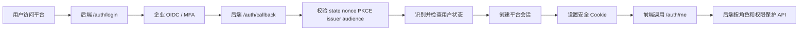

# 登录认证与角色权限生产上线规划

## 文档状态

- 状态：规划中
- 开发状态：未启动
- 启动条件：等待产品负责人明确通知后再进入实现阶段
- 适用范围：供应商风险监控平台生产级多用户访问
- 当前假设：单一企业组织内部使用，所有已授权用户共享同一业务数据集；本阶段不建设多租户隔离

## 1. 目标与非目标

### 1.1 目标

1. 使用企业统一身份系统完成登录、退出、MFA 和账号生命周期管理。
2. 服务端可信识别用户身份，彻底移除浏览器自报 `X-User-Role` 的授权方式。
3. 用四个固定角色覆盖当前业务需求：只读用户、风险分析员、风险运营管理员、平台管理员。
4. 对所有业务读写接口实施默认拒绝、按权限授权和敏感操作审计。
5. 支持会话过期、主动退出、用户停用、角色变更后的即时会话撤销。
6. 确保风险助手会话按用户隔离，避免通过会话 ID 越权读取其他用户对话。

### 1.2 非目标

- 本阶段不自建密码、短信验证码、密码找回和 MFA 系统。
- 本阶段不建设动态角色编辑器或可视化权限策略引擎。
- 本阶段不建设多租户数据隔离；若未来服务多个独立组织，需另立多租户设计和迁移计划。
- 本阶段不把平台管理员拆成多个运维子角色。

## 2. 核心架构决策

### 2.1 身份认证

采用企业 OIDC（OpenID Connect）登录，优先复用现有企业身份提供商：

- Microsoft 环境优先使用 Entra ID。
- 已有统一认证平台时使用其 OIDC 接口。
- 没有现成 IdP 时再评估 Keycloak；不在业务平台内自建密码体系。

登录采用 Authorization Code + PKCE。后端作为 BFF（Backend for Frontend）处理回调，浏览器不保存 OIDC Access Token。

### 2.2 会话

登录成功后由后端创建不透明会话，使用 `HttpOnly`、`Secure`、`SameSite=Lax` Cookie 保存会话标识。

建议默认策略：

- 空闲超时：30 分钟。
- 绝对超时：8 小时。
- 管理员角色强制由 IdP 执行 MFA。
- 用户停用、角色变更、管理员主动撤销时立即废止现有会话。
- 写请求校验 CSRF Token 和 `Origin`。

### 2.3 授权

服务端每个请求都根据当前会话加载用户和角色，不信任浏览器提交的角色、用户 ID 或权限列表。

第一版每个用户只有一个角色，数据库保存 `role` 字段；权限集合固定在代码中，不引入角色继承表和动态权限配置。角色变更必须写入安全审计，并撤销用户现有会话。

## 3. 领域模型

### 用户

用户是经过企业 IdP 认证的自然人，以 `(oidc_issuer, oidc_subject)` 唯一识别。邮箱和显示名称仅作为展示属性，不能作为稳定主键。

### 角色

角色是平台权限集合，不等同于企业岗位名称。一个用户在本阶段只拥有一个角色。

### 权限

权限是服务端允许执行的业务动作，例如查看风险、维护供应商、发布规则、管理用户。

### 会话

会话是用户完成登录后在平台内的访问状态，必须可过期、可撤销并可追溯到用户。

### 安全审计事件

安全审计事件记录登录、退出、认证失败、越权、角色变更、用户停用和会话撤销等行为；记录必须脱敏且不可由普通业务接口修改或删除。

### Agent 会话

Agent 会话是风险助手或数据源接入助手的对话容器，必须关联所属用户和助手类型。用户只能读取、继续或关闭自己的 Agent 会话。

## 4. 四角色权限设计

| 角色 | 代码 | 定位 |
|---|---|---|
| 只读用户 | `viewer` | 查看平台业务数据，不产生业务写入 |
| 风险分析员 | `risk_analyst` | 进行风险分析、查询和报告导出 |
| 风险运营管理员 | `risk_admin` | 维护供应商、数据源、规则和风险处理流程 |
| 平台管理员 | `platform_admin` | 管理用户、角色、会话和平台全部功能 |

权限集合按以下层级累加，但实际实现为四套固定权限集合：

```text
platform_admin
  └─ risk_admin
       └─ risk_analyst
            └─ viewer
```

| 功能 | viewer | risk_analyst | risk_admin | platform_admin |
|---|:---:|:---:|:---:|:---:|
| 查看风险总览、提醒、事件 | ✓ | ✓ | ✓ | ✓ |
| 查看供应商和生产地点 | ✓ | ✓ | ✓ | ✓ |
| 查看数据源运行状态 | ✓ | ✓ | ✓ | ✓ |
| 查看规则摘要和版本 | ✓ | ✓ | ✓ | ✓ |
| 使用风险查询助手 |  | ✓ | ✓ | ✓ |
| 授权的外部企业核查 |  | ✓ | ✓ | ✓ |
| 导出风险报告 |  | ✓ | ✓ | ✓ |
| 新增、修改、导入、停用供应商 |  |  | ✓ | ✓ |
| 导入风险信号、执行分析和风险处理 |  |  | ✓ | ✓ |
| 新增、修改、发布、启停数据源 |  |  | ✓ | ✓ |
| 手动触发数据源采集 |  |  | ✓ | ✓ |
| 使用数据源接入 Agent |  |  | ✓ | ✓ |
| 测试、启停和发布规则 |  |  | ✓ | ✓ |
| 查看业务操作审计 |  |  | ✓ | ✓ |
| 用户启停和角色分配 |  |  |  | ✓ |
| 撤销用户会话 |  |  |  | ✓ |
| 查看登录和安全审计 |  |  |  | ✓ |
| 修改认证和平台安全配置 |  |  |  | ✓ |

取消独立的审计员角色，但保留审计能力：风险运营管理员查看业务操作审计，平台管理员查看完整安全审计。

## 5. 登录流程



详细要求：

1. `/auth/login` 生成 `state`、`nonce` 和 PKCE 参数，并保存短期登录上下文。
2. OIDC 回调必须校验签名、发行者、客户端、受众、时间窗口、`state`、`nonce` 和 PKCE。
3. 以 `(issuer, subject)` 查找用户，不使用邮箱作为身份主键。
4. 新用户默认进入 `pending`，由平台管理员审批；不得首次登录自动获得管理员权限。
5. 登录成功后创建会话并记录安全审计事件。
6. 前端通过 `/auth/me` 获取真实用户、角色和权限，不能自行切换角色。
7. 任何业务接口均通过服务端依赖检查登录状态和具体权限。

## 6. 建议数据模型

新增或调整以下数据：

### `users`

- `id`
- `oidc_issuer`
- `oidc_subject`
- `email`
- `display_name`
- `role`：`viewer`、`risk_analyst`、`risk_admin`、`platform_admin`
- `status`：`pending`、`active`、`disabled`
- `last_login_at`
- `created_at`、`updated_at`

对 `(oidc_issuer, oidc_subject)` 建唯一约束。邮箱允许变化。

### `auth_sessions`

- 随机会话标识的哈希值
- `user_id`
- 创建时间、最近活动时间、过期时间
- 撤销时间和撤销原因
- 脱敏后的 IP、User-Agent 或请求追踪信息

### `security_audit_events`

- 操作者用户 ID或系统主体
- 动作、资源类型、资源 ID
- 成功/失败结果
- 请求 ID、来源 IP、时间
- 脱敏后的变更摘要

禁止写入 Cookie、Token、OIDC 完整声明、API Key 和明文凭据。

### `agent_sessions`

增加 `owner_user_id`，并在查询、继续对话和删除时强制按当前用户过滤。现有历史会话在认证迁移时应全部过期，或明确归属后再开放访问。

## 7. 现有接口整改范围

以下当前写接口必须纳入统一授权：

- 供应商新增、修改、导入、启停。
- 风险信号导入。
- AI 分析和风险处理。
- 手动使风险提醒失效。
- 数据源新增、修改、发布、删除、启停、运行。
- 数据源接入 Agent。
- 规则测试、启停和配置更新。

所有业务读取接口也必须要求登录。仅保留以下公开路径：

- 前端静态资源。
- 登录、回调和退出入口。
- 最小化存活探针。

生产环境应关闭或限制 API 文档和 OpenAPI 文件。

数据源接口需要拆分：普通用户只看运行状态，`risk_admin` 才能读取完整适配器配置和管理操作。

## 8. 分阶段实施计划

### 阶段 0：方案确认

- 确认企业 OIDC 提供商、域名、回调地址和管理员 MFA 策略。
- 确认单组织范围；若需要多租户，停止本方案并另立设计。
- 确认首位平台管理员的 OIDC `issuer + subject`。
- 固化四角色权限矩阵和接口清单。

### 阶段 1：后端认证基础

- 增加用户、会话和安全审计迁移。
- 实现登录、OIDC 回调、当前用户、退出和会话撤销接口。
- 实现 `current_user`、`require_permission` 等服务端授权依赖。
- 移除对 `X-User-Role` 和 `X-User-Id` 的信任。
- 给 Agent 会话补充用户所有权。

### 阶段 2：全接口授权

- 为每条业务路由声明权限。
- 补齐供应商、信号、AI、风险提醒等现有缺口。
- 拆分数据源摘要和管理员详情响应。
- 为用户启停、角色变更、规则发布、数据源发布等敏感动作写审计。

### 阶段 3：前端登录改造

- 删除“切换管理员模式/只读模式”按钮。
- 增加登录页、当前用户信息和退出入口。
- 根据 `/auth/me` 返回的权限显示菜单和操作按钮。
- 统一处理 `401`、`403`、会话过期和 CSRF 失败。

### 阶段 4：部署加固

- 由反向代理暴露 HTTPS，FastAPI 仅在内部网络监听。
- 配置 TLS、HSTS、CSP、安全响应头和请求限制。
- OIDC 客户端密钥进入生产密钥管理服务。
- 建立数据库备份、会话清理和安全审计保留策略。

### 阶段 5：预发布和灰度上线

- 在预发布环境接入真实 IdP。
- 预建平台管理员和四类测试账号。
- 完成权限矩阵、越权、会话撤销和审计验收。
- 灰度开放内部用户，确认稳定后再开放正式访问入口。

## 9. 测试与上线门禁

必须通过以下检查：

- 伪造 `X-User-Role: admin` 无法获得管理员权限。
- 未登录访问业务 API 返回 `401`。
- 已登录越权访问返回 `403`。
- 角色变更、用户停用和主动退出能立即撤销会话。
- 用户无法读取其他用户的 Agent 会话。
- OIDC `state` 重放、PKCE 错误、过期回调和错误受众均被拒绝。
- Cookie、Token、密钥不会写入日志或前端持久化存储。
- 所有敏感写操作均有脱敏审计记录。
- 同一用户多标签页和多设备会话行为符合预期。
- HTTPS、反向代理、备份恢复和认证故障回滚演练通过。

## 10. 预计开发涉及的文件范围

收到启动通知后，预计按最小范围修改：

- 新增 `backend/app/auth` 认证、会话、权限和审计模块。
- 新增一条 Alembic 迁移，创建用户/会话/安全审计表并补充 Agent 会话归属。
- 修改现有各业务 Router，统一接入登录和权限依赖。
- 修改 `frontend/src/api.ts`、`App.tsx` 和登录相关组件，移除前端角色切换。
- 更新 `compose.yaml`、生产部署说明和认证配置示例。
- 新增认证、授权、越权、会话和 Agent 会话隔离测试。

在收到明确启动通知前，不执行上述代码、迁移、依赖和部署改动。
